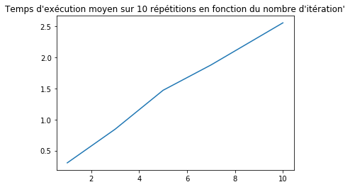

# Elements logiciels  pour le traitement des données massives

<b> Projet de fin de semestre - année universitaire 2019-2020 

Hugo Thimonier, Gabriel Kasmi - 3A DS-SA </b>

# 2. Formattage de l'algorithme initial

Dans le premier notebook, nous avons présenté le problème et procédé à une première analyse. Avant d'optimiser plus avant l'algorithme (notebook 3) et ultimement de le paralléliser (notebook 4), nous allons le réécrire et analyser plus finement les performances. Enfin dans le 5e notebook, nous comparons directement toutes les approches.

Nous introduisons également dans ce notebook les outils nécessaires au diagnostic de la performance.


```python
from jyquickhelper import add_notebook_menu
add_notebook_menu()
```


<div id="my_id_menu_nb">run previous cell, wait for 2 seconds</div>
<script>
function repeat_indent_string(n){
    var a = "" ;
    for ( ; n > 0 ; --n)
        a += "    ";
    return a;
}
// look up into all sections and builds an automated menu //
var update_menu_string = function(begin, lfirst, llast, sformat, send, keep_item, begin_format, end_format) {
    var anchors = document.getElementsByClassName("section");
    if (anchors.length == 0) {
        anchors = document.getElementsByClassName("text_cell_render rendered_html");
    }
    var i,t;
    var text_menu = begin;
    var text_memo = "<pre>\nlength:" + anchors.length + "\n";
    var ind = "";
    var memo_level = 1;
    var href;
    var tags = [];
    var main_item = 0;
    var format_open = 0;
    for (i = 0; i <= llast; i++)
        tags.push("h" + i);

    for (i = 0; i < anchors.length; i++) {
        text_memo += "**" + anchors[i].id + "--\n";

        var child = null;
        for(t = 0; t < tags.length; t++) {
            var r = anchors[i].getElementsByTagName(tags[t]);
            if (r.length > 0) {
child = r[0];
break;
            }
        }
        if (child == null) {
            text_memo += "null\n";
            continue;
        }
        if (anchors[i].hasAttribute("id")) {
            // when converted in RST
            href = anchors[i].id;
            text_memo += "#1-" + href;
            // passer à child suivant (le chercher)
        }
        else if (child.hasAttribute("id")) {
            // in a notebook
            href = child.id;
            text_memo += "#2-" + href;
        }
        else {
            text_memo += "#3-" + "*" + "\n";
            continue;
        }
        var title = child.textContent;
        var level = parseInt(child.tagName.substring(1,2));

        text_memo += "--" + level + "?" + lfirst + "--" + title + "\n";

        if ((level < lfirst) || (level > llast)) {
            continue ;
        }
        if (title.endsWith('¶')) {
            title = title.substring(0,title.length-1).replace("<", "&lt;")
         .replace(">", "&gt;").replace("&", "&amp;");
        }
        if (title.length == 0) {
            continue;
        }

        while (level < memo_level) {
            text_menu += end_format + "</ul>\n";
            format_open -= 1;
            memo_level -= 1;
        }
        if (level == lfirst) {
            main_item += 1;
        }
        if (keep_item != -1 && main_item != keep_item + 1) {
            // alert(main_item + " - " + level + " - " + keep_item);
            continue;
        }
        while (level > memo_level) {
            text_menu += "<ul>\n";
            memo_level += 1;
        }
        text_menu += repeat_indent_string(level-2);
        text_menu += begin_format + sformat.replace("__HREF__", href).replace("__TITLE__", title);
        format_open += 1;
    }
    while (1 < memo_level) {
        text_menu += end_format + "</ul>\n";
        memo_level -= 1;
        format_open -= 1;
    }
    text_menu += send;
    //text_menu += "\n" + text_memo;

    while (format_open > 0) {
        text_menu += end_format;
        format_open -= 1;
    }
    return text_menu;
};
var update_menu = function() {
    var sbegin = "";
    var sformat = '<a href="#__HREF__">__TITLE__</a>';
    var send = "";
    var begin_format = '<li>';
    var end_format = '</li>';
    var keep_item = -1;
    var text_menu = update_menu_string(sbegin, 2, 4, sformat, send, keep_item,
       begin_format, end_format);
    var menu = document.getElementById("my_id_menu_nb");
    menu.innerHTML=text_menu;
};
window.setTimeout(update_menu,2000);
            </script>


```python
%run '../lib/dpmm_optimized.py'
%run '../lib/utilities.py'
```


```python
import collections
```


```python
# Define the parameters

# Fichiers auxiliaires, utilitaires et paramètres
# %run 'utilities.py'

# Distribution a priori des centroïdes des clusters :
mu_0 = np.array([0, 0]) # Espérance de la loi normale pour mu.
Sigma_0 = 32 * np.eye(2) # Variance (échelle) de la loi normale pour mu.

# Distribution a priori des variances des clusters : 
nu = 9.0 # Nombre de degrés de liberté de la loi inv-Wishart.
sigma_0 =  1. # "Variance" (échelle) pour la loi inv-Wishart.

# Paramètres complémentaires pour l'inférence.
alpha = 0.03 # Paramètre d'échelle pour le processus de Dirichelet.
sigma_x = 0.5 # Bruit sur les observations.

# Nombre d'itérations pour l'algorithme de Gibbs :
n_iter = 1


# Importation du CSV des observations simulées

raw_input = pd.read_csv('../data/simulated_observations.csv')
data = raw_input[["x_coordinate",'y_coordinate']]

# Pour l'assignation des clusters, on a le choix. On commence avec une assignation 
# initiale dans un même cluster. 
c_pooled = np.ones(data.shape[0])

data.head()

```


<div>
<style scoped>
    .dataframe tbody tr th:only-of-type {
        vertical-align: middle;
    }

    .dataframe tbody tr th {
        vertical-align: top;
    }

    .dataframe thead th {
        text-align: right;
    }
</style>
<table border="1" class="dataframe">
  <thead>
    <tr style="text-align: right;">
      <th></th>
      <th>x_coordinate</th>
      <th>y_coordinate</th>
    </tr>
  </thead>
  <tbody>
    <tr>
      <th>0</th>
      <td>-2.934991</td>
      <td>-7.007746</td>
    </tr>
    <tr>
      <th>1</th>
      <td>6.356237</td>
      <td>0.884789</td>
    </tr>
    <tr>
      <th>2</th>
      <td>-7.083561</td>
      <td>3.303427</td>
    </tr>
    <tr>
      <th>3</th>
      <td>-3.678442</td>
      <td>-7.383803</td>
    </tr>
    <tr>
      <th>4</th>
      <td>-2.803186</td>
      <td>-1.294134</td>
    </tr>
  </tbody>
</table>
</div>


```python
# Define the tuple of arguemnts
Parameters = collections.namedtuple('Parameters', ['alpha',  'mu_0', 'Sigma_0', 'sigma_x', 'n_iter', 'c_init'])
args = Parameters(alpha = alpha, mu_0 = mu_0, Sigma_0 = Sigma_0, sigma_x = sigma_x, n_iter = 1, c_init = c_pooled)
```

### Premiers chronométrages

La fonction a été réécrite pour que le diagnostic du temps d'éxecution soit plus simple à effectuer. Son fonctionnement a également été modifié, de manière à ce que certaines fonctions actuellement écrites en python puissent être réécrites en cython pour gagner en vitesse d'exécution.


```python
# La fonction renvoie désormais un temps d'exécution.
dpmm_algorithm(data, args, savetime = True, traceback = False)[1]
```


    0.5606379508972168


```python
# Chronométrage sur 100 répétitions

mean_time(dpmm_algorithm, 100, (data,args))
```


    0.25700294971466064


### Recensement et visualisation des threads


```python
# Recensement des threads
import cProfile

pr = cProfile.Profile()
pr.enable()
 
dpmm_algorithm(data, args)
 
pr.disable()
 
pr.print_stats(sort='time')
```

             164197 function calls (164192 primitive calls) in 0.375 seconds
    
       Ordered by: internal time
    
       ncalls  tottime  percall  cumtime  percall filename:lineno(function)
         8794    0.041    0.000    0.041    0.000 {method 'reduce' of 'numpy.ufunc' objects}
         1424    0.031    0.000    0.186    0.000 _multivariate.py:147(__init__)
         1424    0.028    0.000    0.088    0.000 decomp.py:270(eigh)
         1175    0.023    0.000    0.038    0.000 linalg.py:486(inv)
            1    0.021    0.021    0.374    0.374 dpmm_optimized.py:94(dpmm_algorithm)
         1424    0.020    0.000    0.034    0.000 _multivariate.py:438(_logpdf)
         1174    0.017    0.000    0.267    0.000 dpmm_optimized.py:22(compute_log_probability)
         7370    0.014    0.000    0.054    0.000 fromnumeric.py:69(_wrapreduction)
         9973    0.014    0.000    0.014    0.000 {built-in method numpy.array}
          250    0.012    0.000    0.018    0.000 {method 'choice' of 'mtrand.RandomState' objects}
         1424    0.010    0.000    0.029    0.000 blas.py:297(_get_funcs)
         4946    0.009    0.000    0.009    0.000 {built-in method numpy.dot}
         1424    0.008    0.000    0.247    0.000 _multivariate.py:465(logpdf)
         1424    0.008    0.000    0.028    0.000 _multivariate.py:52(_eigvalsh_to_eps)
         1424    0.008    0.000    0.026    0.000 _util.py:192(_asarray_validated)
         1424    0.007    0.000    0.008    0.000 _multivariate.py:104(<listcomp>)
         4272    0.006    0.000    0.039    0.000 fromnumeric.py:1966(sum)
         1424    0.006    0.000    0.015    0.000 blas.py:236(find_best_blas_type)
         1424    0.006    0.000    0.016    0.000 function_base.py:434(asarray_chkfinite)
         1424    0.005    0.000    0.012    0.000 _multivariate.py:360(_process_parameters)
         7370    0.005    0.000    0.005    0.000 fromnumeric.py:70(<dictcomp>)
         4274    0.004    0.000    0.004    0.000 {built-in method builtins.getattr}
         1424    0.003    0.000    0.007    0.000 numerictypes.py:602(find_common_type)
         4272    0.003    0.000    0.003    0.000 {built-in method builtins.abs}
         1176    0.003    0.000    0.003    0.000 {method 'astype' of 'numpy.ndarray' objects}
         8546    0.003    0.000    0.003    0.000 {built-in method builtins.isinstance}
         1424    0.003    0.000    0.016    0.000 _multivariate.py:87(_pinv_1d)
         1424    0.003    0.000    0.004    0.000 _multivariate.py:420(_process_quantiles)
         1175    0.003    0.000    0.005    0.000 linalg.py:144(_commonType)
         1924    0.003    0.000    0.003    0.000 getlimits.py:365(__new__)
         8296    0.003    0.000    0.010    0.000 numeric.py:469(asarray)
          250    0.002    0.000    0.007    0.000 dpmm_optimized.py:78(convert_into_probabilities)
         1174    0.002    0.000    0.002    0.000 {built-in method numpy.where}
         1424    0.002    0.000    0.003    0.000 _multivariate.py:40(_squeeze_output)
         1424    0.002    0.000    0.015    0.000 fromnumeric.py:2397(amax)
         5948    0.002    0.000    0.002    0.000 {method 'get' of 'dict' objects}
         1424    0.002    0.000    0.031    0.000 lapack.py:520(get_lapack_funcs)
          250    0.002    0.000    0.045    0.000 dpmm_optimized.py:56(compute_not_cluster_log_prob)
         1424    0.002    0.000    0.002    0.000 type_check.py:282(iscomplexobj)
         2848    0.002    0.000    0.002    0.000 numerictypes.py:578(_can_coerce_all)
         5700    0.002    0.000    0.002    0.000 {built-in method builtins.issubclass}
         1175    0.002    0.000    0.003    0.000 linalg.py:116(_makearray)
    8561/8557    0.001    0.000    0.001    0.000 {built-in method builtins.len}
         1424    0.001    0.000    0.009    0.000 fromnumeric.py:2512(amin)
         1175    0.001    0.000    0.001    0.000 linalg.py:111(get_linalg_error_extobj)
         7370    0.001    0.000    0.001    0.000 {method 'items' of 'dict' objects}
         1424    0.001    0.000    0.009    0.000 {method 'all' of 'numpy.ndarray' objects}
         1175    0.001    0.000    0.001    0.000 linalg.py:209(_assertNdSquareness)
         1424    0.001    0.000    0.001    0.000 {built-in method math.log}
         1175    0.001    0.000    0.001    0.000 linalg.py:203(_assertRankAtLeast2)
          250    0.001    0.000    0.001    0.000 {built-in method builtins.max}
         2350    0.001    0.000    0.001    0.000 linalg.py:121(isComplexType)
         1424    0.001    0.000    0.001    0.000 {method 'squeeze' of 'numpy.ndarray' objects}
         1424    0.001    0.000    0.001    0.000 numerictypes.py:654(<listcomp>)
          250    0.001    0.000    0.001    0.000 dpmm_optimized.py:89(<listcomp>)
         1424    0.001    0.000    0.001    0.000 base.py:1187(isspmatrix)
         1424    0.001    0.000    0.008    0.000 _methods.py:45(_all)
         1424    0.001    0.000    0.001    0.000 blas.py:277(<listcomp>)
         1424    0.001    0.000    0.001    0.000 {method 'index' of 'list' objects}
          500    0.001    0.000    0.001    0.000 numerictypes.py:293(issubclass_)
         1424    0.001    0.000    0.001    0.000 core.py:6199(isMaskedArray)
         1175    0.001    0.000    0.001    0.000 linalg.py:134(_realType)
          250    0.001    0.000    0.002    0.000 numerictypes.py:365(issubdtype)
          3/2    0.001    0.000    0.374    0.187 {built-in method builtins.exec}
         1424    0.000    0.000    0.000    0.000 {method 'lower' of 'str' objects}
          250    0.000    0.000    0.003    0.000 fromnumeric.py:2664(prod)
         1424    0.000    0.000    0.000    0.000 misc.py:177(_datacopied)
          251    0.000    0.000    0.000    0.000 {built-in method numpy.empty}
            1    0.000    0.000    0.000    0.000 {built-in method numpy.concatenate}
         1175    0.000    0.000    0.000    0.000 {method '__array_prepare__' of 'numpy.ndarray' objects}
         1425    0.000    0.000    0.000    0.000 {method 'append' of 'list' objects}
         1424    0.000    0.000    0.000    0.000 numerictypes.py:655(<listcomp>)
            1    0.000    0.000    0.000    0.000 {method 'sort' of 'numpy.ndarray' objects}
            1    0.000    0.000    0.001    0.001 arraysetops.py:299(_unique1d)
          251    0.000    0.000    0.000    0.000 {method 'keys' of 'dict' objects}
            2    0.000    0.000    0.000    0.000 {built-in method builtins.compile}
            1    0.000    0.000    0.001    0.001 __init__.py:357(namedtuple)
            1    0.000    0.000    0.000    0.000 {built-in method builtins.__build_class__}
           13    0.000    0.000    0.000    0.000 {method 'format' of 'str' objects}
            1    0.000    0.000    0.000    0.000 function_base.py:1149(diff)
            2    0.000    0.000    0.375    0.187 interactiveshell.py:2933(run_code)
            2    0.000    0.000    0.000    0.000 twodim_base.py:154(eye)
            1    0.000    0.000    0.000    0.000 <string>:5(InnerParameters)
            1    0.000    0.000    0.000    0.000 <string>:1(<module>)
            2    0.000    0.000    0.000    0.000 managers.py:203(_is_single_block)
            2    0.000    0.000    0.000    0.000 codeop.py:132(__call__)
            1    0.000    0.000    0.000    0.000 managers.py:790(as_array)
            1    0.000    0.000    0.001    0.001 arraysetops.py:151(unique)
            3    0.000    0.000    0.000    0.000 <frozen importlib._bootstrap>:997(_handle_fromlist)
            1    0.000    0.000    0.374    0.374 <ipython-input-9-c067e25adece>:7(<module>)
            2    0.000    0.000    0.000    0.000 {method 'join' of 'str' objects}
            1    0.000    0.000    0.000    0.000 {method 'flatten' of 'numpy.ndarray' objects}
            1    0.000    0.000    0.000    0.000 <string>:12(__new__)
            2    0.000    0.000    0.000    0.000 {built-in method numpy.zeros}
            1    0.000    0.000    0.000    0.000 generic.py:5236(_protect_consolidate)
            2    0.000    0.000    0.000    0.000 ipstruct.py:125(__getattr__)
            1    0.000    0.000    0.000    0.000 fromnumeric.py:54(_wrapfunc)
            1    0.000    0.000    0.000    0.000 generic.py:5181(__setattr__)
            4    0.000    0.000    0.000    0.000 {built-in method builtins.hasattr}
            7    0.000    0.000    0.000    0.000 __init__.py:420(<genexpr>)
            2    0.000    0.000    0.000    0.000 hooks.py:142(__call__)
            1    0.000    0.000    0.000    0.000 common.py:225(is_object_dtype)
            1    0.000    0.000    0.000    0.000 generic.py:5246(_consolidate_inplace)
            1    0.000    0.000    0.000    0.000 generic.py:5368(values)
            4    0.000    0.000    0.000    0.000 blocks.py:239(mgr_locs)
            1    0.000    0.000    0.000    0.000 <ipython-input-9-c067e25adece>:9(<module>)
            7    0.000    0.000    0.000    0.000 {method '__contains__' of 'frozenset' objects}
            1    0.000    0.000    0.000    0.000 {method 'replace' of 'str' objects}
            1    0.000    0.000    0.000    0.000 {built-in method builtins.repr}
            7    0.000    0.000    0.000    0.000 __init__.py:422(<genexpr>)
            1    0.000    0.000    0.000    0.000 {method 'nonzero' of 'numpy.ndarray' objects}
            1    0.000    0.000    0.000    0.000 {method 'transpose' of 'numpy.ndarray' objects}
            3    0.000    0.000    0.000    0.000 numeric.py:541(asanyarray)
            1    0.000    0.000    0.000    0.000 fromnumeric.py:1694(nonzero)
            2    0.000    0.000    0.000    0.000 base.py:723(__len__)
            1    0.000    0.000    0.000    0.000 generic.py:5249(f)
            6    0.000    0.000    0.000    0.000 {method 'startswith' of 'str' objects}
            1    0.000    0.000    0.000    0.000 common.py:211(<lambda>)
            1    0.000    0.000    0.000    0.000 common.py:209(classes)
            1    0.000    0.000    0.000    0.000 common.py:1886(_is_dtype_type)
            1    0.000    0.000    0.000    0.000 blocks.py:217(get_values)
            2    0.000    0.000    0.000    0.000 managers.py:171(ndim)
            2    0.000    0.000    0.000    0.000 managers.py:325(__len__)
            1    0.000    0.000    0.000    0.000 managers.py:646(is_consolidated)
            6    0.000    0.000    0.000    0.000 {method 'add' of 'set' objects}
            1    0.000    0.000    0.000    0.000 {built-in method __new__ of type object at 0x1039bddd8}
            7    0.000    0.000    0.000    0.000 {method 'isidentifier' of 'str' objects}
            1    0.000    0.000    0.000    0.000 {built-in method sys._getframe}
            2    0.000    0.000    0.000    0.000 interactiveshell.py:1104(user_global_ns)
            2    0.000    0.000    0.000    0.000 hooks.py:207(pre_run_code_hook)
            1    0.000    0.000    0.000    0.000 {built-in method numpy.core._multiarray_umath.normalize_axis_index}
            1    0.000    0.000    0.000    0.000 arraysetops.py:138(_unpack_tuple)
            2    0.000    0.000    0.000    0.000 managers.py:236(items)
            1    0.000    0.000    0.000    0.000 managers.py:919(consolidate)
            1    0.000    0.000    0.000    0.000 {method 'disable' of '_lsprof.Profiler' objects}
    
    


```python
# Affichage des threads sous forme de graphe

from pycallgraph import PyCallGraph
from pycallgraph.output import GraphvizOutput

graphviz = GraphvizOutput()
graphviz.output_file = '../figures/threads_fonctionnalized_algorithm.png'

with PyCallGraph(output=graphviz, config=None):
    dpmm_algorithm(data, args)
    
    
from IPython.display import Image
Image(filename='../figures/threads_fonctionnalized_algorithm.png')     
```


Ce graphique permet de mettre en lumière quelles sont les fonctions les plus appelées par notre algorithme et ainsi les étapes clefs à optimiser. On observe que la fonction compute log probability est la fonction la plus utilisée, il est donc important d'optimiser cette étape en priorité. 

Nous pouvons voir par rapport à la version initiale que l'algorithme appelle trois fonctions, ```compute_log_probability```, ```compute_not_cluster_log_prob``` et ```convert_into_probabilities```. Lors de la réécriture du programme, nous avons introduit ces fonctions car ce sont des étapes clefs dans le déroulement de l'algorithme et nous voulons dans le notebook suivant réécrire ces trois fonctions en C de sorte à optimiser les performances.

### Performances en fonction du nombre d'itérations


```python
import numpy as np
from progressbar import ProgressBar

pbar = ProgressBar()

values = np.linspace(1,10,5, dtype = int)
times = []
for j in pbar(values):
    args = Parameters(alpha = alpha, mu_0 = mu_0, Sigma_0 = Sigma_0, sigma_x = sigma_x, n_iter = j, c_init = c_pooled)
    times.append(mean_time(dpmm_algorithm, 10, (data,args)))
```

    100% |########################################################################|


```python
import matplotlib.pyplot as plt

plt.plot(values, times)
plt.title("Temps d'exécution moyen sur 10 répétitions en fonction du nombre d'itération'")
plt.show()
```





On observe ici une croissance linéaire du temps d'execution lorsque le nombre d'itération augmente.

### Performances en fonction du nombre d'observations


```python
# Charger les données avec 500 et 1000 observations

raw_2 = pd.read_csv('../data/simulated_observations_500.csv')
data_500 = raw_2[["x_coordinate",'y_coordinate']]

raw_3 = pd.read_csv('../data/simulated_observations_1000.csv')
data_1000 = raw_3[["x_coordinate",'y_coordinate']]

# Liste avec les trois données 

observations = {250 : data,
               500 : data_500,
               1000 : data_1000}

# Nombre d'observations et calcul du temps d'éxecution avec 10 itérations à chaque pas

times_obs = []
for d in observations.keys():
    data_shape = observations[d].shape[0]
    args = Parameters(alpha = alpha, mu_0 = mu_0, Sigma_0 = Sigma_0, sigma_x = sigma_x, n_iter = 10, c_init = np.ones(data_shape))
    times_obs.append(mean_time(dpmm_algorithm, 10, (observations[d],args)))

plt.plot(observations.keys(), times_obs)
plt.title("Temps d'exécution moyen sur 10 répétitions pour 10 itérations en fonction du nombre d'observations")
plt.show()        
```


