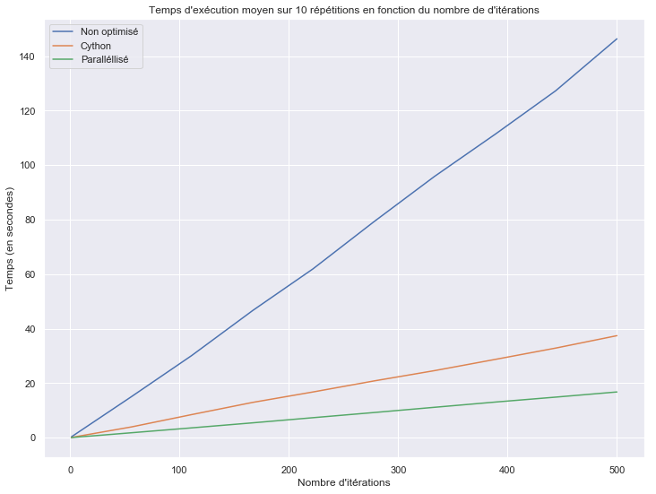
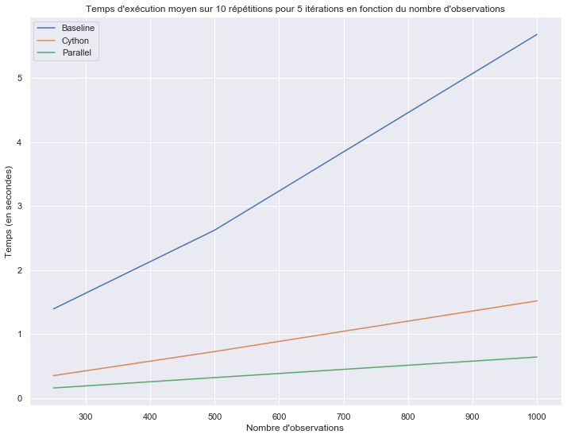

# Elements logiciels  pour le traitement des données massives

<b> Projet de fin de semestre - année universitaire 2019-2020 

Hugo Thimonier, Gabriel Kasmi - 3A DS-SA </b>

# 5. Comparaison des algorithmes

Dans ce dernier notebook, nous comparons directement l'évolution des performances à mesure que nous avons optimisé notre code.


```python
from jyquickhelper import add_notebook_menu
add_notebook_menu()
```


<div id="my_id_menu_nb">run previous cell, wait for 2 seconds</div>
<script>
function repeat_indent_string(n){
    var a = "" ;
    for ( ; n > 0 ; --n)
        a += "    ";
    return a;
}
// look up into all sections and builds an automated menu //
var update_menu_string = function(begin, lfirst, llast, sformat, send, keep_item, begin_format, end_format) {
    var anchors = document.getElementsByClassName("section");
    if (anchors.length == 0) {
        anchors = document.getElementsByClassName("text_cell_render rendered_html");
    }
    var i,t;
    var text_menu = begin;
    var text_memo = "<pre>\nlength:" + anchors.length + "\n";
    var ind = "";
    var memo_level = 1;
    var href;
    var tags = [];
    var main_item = 0;
    var format_open = 0;
    for (i = 0; i <= llast; i++)
        tags.push("h" + i);

    for (i = 0; i < anchors.length; i++) {
        text_memo += "**" + anchors[i].id + "--\n";

        var child = null;
        for(t = 0; t < tags.length; t++) {
            var r = anchors[i].getElementsByTagName(tags[t]);
            if (r.length > 0) {
child = r[0];
break;
            }
        }
        if (child == null) {
            text_memo += "null\n";
            continue;
        }
        if (anchors[i].hasAttribute("id")) {
            // when converted in RST
            href = anchors[i].id;
            text_memo += "#1-" + href;
            // passer à child suivant (le chercher)
        }
        else if (child.hasAttribute("id")) {
            // in a notebook
            href = child.id;
            text_memo += "#2-" + href;
        }
        else {
            text_memo += "#3-" + "*" + "\n";
            continue;
        }
        var title = child.textContent;
        var level = parseInt(child.tagName.substring(1,2));

        text_memo += "--" + level + "?" + lfirst + "--" + title + "\n";

        if ((level < lfirst) || (level > llast)) {
            continue ;
        }
        if (title.endsWith('¶')) {
            title = title.substring(0,title.length-1).replace("<", "&lt;")
         .replace(">", "&gt;").replace("&", "&amp;");
        }
        if (title.length == 0) {
            continue;
        }

        while (level < memo_level) {
            text_menu += end_format + "</ul>\n";
            format_open -= 1;
            memo_level -= 1;
        }
        if (level == lfirst) {
            main_item += 1;
        }
        if (keep_item != -1 && main_item != keep_item + 1) {
            // alert(main_item + " - " + level + " - " + keep_item);
            continue;
        }
        while (level > memo_level) {
            text_menu += "<ul>\n";
            memo_level += 1;
        }
        text_menu += repeat_indent_string(level-2);
        text_menu += begin_format + sformat.replace("__HREF__", href).replace("__TITLE__", title);
        format_open += 1;
    }
    while (1 < memo_level) {
        text_menu += end_format + "</ul>\n";
        memo_level -= 1;
        format_open -= 1;
    }
    text_menu += send;
    //text_menu += "\n" + text_memo;

    while (format_open > 0) {
        text_menu += end_format;
        format_open -= 1;
    }
    return text_menu;
};
var update_menu = function() {
    var sbegin = "";
    var sformat = '<a href="#__HREF__">__TITLE__</a>';
    var send = "";
    var begin_format = '<li>';
    var end_format = '</li>';
    var keep_item = -1;
    var text_menu = update_menu_string(sbegin, 2, 4, sformat, send, keep_item,
       begin_format, end_format);
    var menu = document.getElementById("my_id_menu_nb");
    menu.innerHTML=text_menu;
};
window.setTimeout(update_menu,2000);
            </script>


```python
# Importation des fichiers
%run '../lib/dpmm_optimized.py'
%run '../lib/utilities.py'
%run '../Fonction_et_utilities/dpmm_optimized_cython.py'
%run '../Fonction_et_utilities/dpmm_optimized_cython_parallel.py'

# Librairies 
import collections
import numpy as np
import pandas as pd
import matplotlib.pyplot as plt
import seaborn as sns
```

### Comparaison des performances en fonction du nombre d'itérations


```python
# Données et paramètres

# Distribution a priori des centroïdes des clusters :
mu_0 = np.array([0, 0]) # Espérance de la loi normale pour mu.
Sigma_0 = 32 * np.eye(2) # Variance (échelle) de la loi normale pour mu.

# Distribution a priori des variances des clusters : 
nu = 9.0 # Nombre de degrés de liberté de la loi inv-Wishart.
sigma_0 =  1. # "Variance" (échelle) pour la loi inv-Wishart.

# Paramètres complémentaires pour l'inférence.
alpha = 0.03 # Paramètre d'échelle pour le processus de Dirichelet.
sigma_x = 0.5 # Bruit sur les observations.

# Importation du CSV des observations simulées

raw_input = pd.read_csv('../data/simulated_observations.csv')
data = raw_input[["x_coordinate",'y_coordinate']]

# Pour l'assignation des clusters, on a le choix. On commence avec une assignation 
# initiale dans un même cluster. 
c_pooled = np.ones(data.shape[0])

# Define the tuple of arguemnts
Parameters = collections.namedtuple('Parameters', ['alpha',  'mu_0', 'Sigma_0', 'sigma_x', 'n_iter', 'c_init'])
args = Parameters(alpha = alpha, mu_0 = mu_0, Sigma_0 = Sigma_0, sigma_x = sigma_x, n_iter = 1, c_init = c_pooled)
```


```python
from progressbar import ProgressBar
pbar = ProgressBar()

# Tests et comparaisons pour l'évolution des performances en fonction du nombre d'itérations

n_reps = 100

values = np.linspace(1,500,10, dtype = int)
times_baseline_it, times_cython_it, times_parallel_it = [], [], []

for j in pbar(values):
    args = Parameters(alpha = alpha, mu_0 = mu_0, Sigma_0 = Sigma_0, sigma_x = sigma_x, n_iter = j, c_init = c_pooled)
    times_baseline_it.append(mean_time(dpmm_algorithm, n_reps, (data,args)))
    times_cython_it.append(mean_time(cython_dpmm_algorithm, n_reps, (data, args)))
    times_intermediate = []
    for i in range(n_reps):
        times_intermediate.append(cython_dpmm_algorithm2(data, alpha, mu_0, Sigma_0, sigma_x, j, c_pooled, savetime = True, traceback = False)[1])
    times_parallel_it.append(np.mean(times_intermediate))
```

    100% |########################################################################|


```python
plt.title("Temps d'exécution moyen sur %s répétitions en fonction du nombre de d'itérations" % n_reps)
plt.plot(values, times_baseline_it, label = "Non optimisé")
plt.plot(values, times_cython_it, label = "Cython")
plt.plot(values, times_parallel_it, label = "Paralléllisé")
plt.ylabel('Temps (en secondes)')
plt.xlabel("Nombre d'itérations")
plt.legend()

plt.savefig('../figures/iterations_comparison.png')
sns.set_context('poster')
sns.set_color_codes()
plot_kwds = {'alpha' : 0.25, 's' : 80, 'linewidths':0}
sns.set(rc={'figure.figsize':(12,9)})
plt.gca()

plt.show()
```





```python
print('Vecteur des temps\nBaseline %s\n\nCython %s\n\nParallel %s' % (times_baseline_it, times_cython_it, times_parallel_it))
```

    Vecteur des temps
    Baseline [0.28847599029541016, 15.06292986869812, 30.11369686126709, 46.68584294319153, 61.92898480892181, 79.30035352706909, 95.80053803920745, 111.41870050430298, 127.27390711307525, 146.3356986761093]
    
    Cython [0.07284550666809082, 3.9417080163955687, 8.458830261230469, 12.947808599472046, 16.763794469833375, 20.823526000976564, 24.579730105400085, 28.733633971214296, 32.86445789337158, 37.419470596313474]
    
    Parallel [0.03135650157928467, 1.798409605026245, 3.592220640182495, 5.4432577133178714, 7.328591322898864, 9.226136374473572, 11.136399459838866, 13.068300127983093, 14.873725485801696, 16.768671131134035]


Les gains les plus spectaculaires sont réalisés lorsque l'on passe de la version standard à la version partiellement réécrite de l'algorithme. Le gain en termes de vitesse d'exécution est d'un facteur 4 entre la version de base et la version en cython et d'un facteur 2 entre la version cython et la version parallélisée.

### Comparaisons sur le nombre d'observations


```python
# Charger les données avec 500 et 1000 observations

raw_2 = pd.read_csv('../data/simulated_observations_500.csv')
data_500 = raw_2[["x_coordinate",'y_coordinate']]

raw_3 = pd.read_csv('../data/simulated_observations_1000.csv')
data_1000 = raw_3[["x_coordinate",'y_coordinate']]

# Liste avec les trois données 

observations = {250 : data,
               500 : data_500,
               1000 : data_1000}

# Nombre d'observations et calcul du temps d'éxecution avec 10 itérations à chaque pas
n_iter, n_reps = 5, 10

times_baseline, times_cython, times_parallel = [], [], []
for d in observations.keys():
    data_shape = observations[d].shape[0]
    c_init = np.ones(data_shape)
    args = Parameters(alpha = alpha, mu_0 = mu_0, Sigma_0 = Sigma_0, sigma_x = sigma_x, n_iter = n_iter, c_init = np.ones(data_shape))
    times_baseline.append(mean_time(dpmm_algorithm, n_reps, (observations[d],args)))
    times_cython.append(mean_time(cython_dpmm_algorithm, n_reps, (observations[d],args)))
    
    times_intermediate = []
    for i in range(n_reps):
        times_intermediate.append(cython_dpmm_algorithm2(observations[d], alpha, mu_0, Sigma_0, sigma_x, n_iter, c_init, savetime = True, traceback = False)[1])
    
    times_parallel.append(np.mean(times_intermediate))
```


```python
plt.plot(observations.keys(), times_baseline, label = "Baseline")
plt.plot(observations.keys(), times_cython, label = "Cython")
plt.plot(observations.keys(), times_parallel, label = "Parallel")
plt.legend()
plt.xlabel("Nombre d'observations")
plt.ylabel("Temps (en secondes)")

plt.savefig('../figures/observations_comparison.png')
plt.title("Temps d'exécution moyen sur %s répétitions pour %s itérations en fonction du nombre d'observations" %(n_reps, n_iter))
plt.show()        
```





```python
print("Vecteur des temps \n Baseline %s \n\n Cython %s \n\n Parallel %s \n\n" %(times_baseline, times_cython, times_parallel))
```

    Vecteur des temps 
     Baseline [1.3916894912719726, 2.622290515899658, 5.680734539031983] 
    
     Cython [0.34923112392425537, 0.7251938104629516, 1.5169919013977051] 
    
     Parallel [0.1558462142944336, 0.31804893016815183, 0.6394919157028198] 
    
    


On observe d'importants gains de temps entre la version python et la version cythonisée, mais également entre la fonction cythonisée et la version cythonisées parallélisée. L'objectif de départ est donc bel et bien atteint, à savoir accélérer la vitesse de l'algorithme de manière significative.
